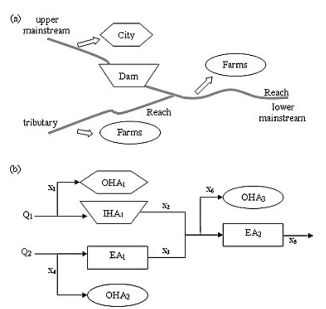
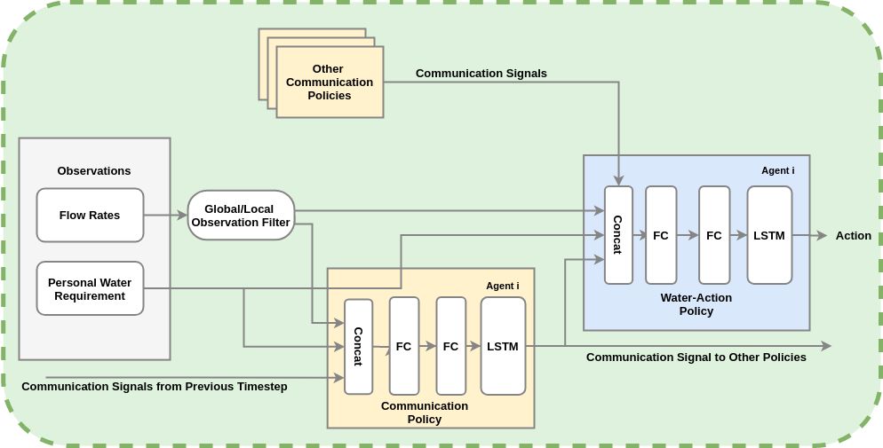

[](https://travis-ci.com/eugenevinitsky/sequential_social_dilemma_games)

# Sequential Social Dilemma Games
This repo is based on open-source implementation of DeepMind's Sequential Social Dilemma (SSD) multi-agent game-theoretic environments [[1]](https://arxiv.org/abs/1702.03037). SSDs can be thought of as analogous to spatially and temporally extended Prisoner's Dilemma-like games. The reward structure poses a dilemma because individual short-term optimal strategies lead to poor long-term outcomes for the group.

The implemented environments are structured to be compatible with OpenAIs gym environments (https://github.com/openai/gym) as well as RLlib's Multiagent Environment (https://github.com/ray-project/ray/blob/master/python/ray/rllib/env/multi_agent_env.py).
Additionally, this codebase implements a commmunication + causal architecture.

## Implemented Games
* **Watershed**: Watershed Management is a problem of resource allocation consisting of several self-interested agents. These agents can withdraw water from a finite but commonsupply of water for individual purposes. The problem involves several constraints,multiple objectives, and optimisation involves continuous variables. Watershed management here is modelled as a multi-agent system.



* **Cleanup**: A public goods dilemma in which agents get a reward for consuming apples, but must use a cleaning beam to clean a river in order for apples to grow. While an agent is cleaning the river, other agents can exploit it by consuming the apples that appear.


* **Harvest**: A tragedy-of-the-commons dilemma in which apples regrow at a rate that depends on the amount of nearby apples. If individual agents employ an exploitative strategy by greedily consuming too many apples, the collective reward of all agents is reduced.


## Communication in Sequential Social Dilemmmas



## Relevant papers

1. Leibo, J. Z., Zambaldi, V., Lanctot, M., Marecki, J., & Graepel, T. (2017). [Multi-agent reinforcement learning in sequential social dilemmas](https://arxiv.org/abs/1702.03037). In Proceedings of the 16th Conference on Autonomous Agents and MultiAgent Systems (pp. 464-473).

2.  Hughes, E., Leibo, J. Z., Phillips, M., Tuyls, K., Dueñez-Guzman, E., Castañeda, A. G., Dunning, I., Zhu, T., McKee, K., Koster, R., Tina Zhu, Roff, H., Graepel, T. (2018). [Inequity aversion improves cooperation in intertemporal social dilemmas](https://arxiv.org/abs/1803.08884). In Advances in Neural Information Processing Systems (pp. 3330-3340).

3. Jaques, N., Lazaridou, A., Hughes, E., Gulcehre, C., Ortega, P. A., Strouse, D. J., Leibo, J. Z. & de Freitas, N. (2018). [Intrinsic Social Motivation via Causal Influence in Multi-Agent RL](https://arxiv.org/abs/1810.08647). arXiv preprint arXiv:1810.08647. 


# Setup instructions
Run `python setup.py develop`
Then, activate your environment by running `source activate causal`.

To then set up the branch of Ray on which we have built the causal influence code, clone the repo to your desired folder:
`git clone https://github.com/natashamjaques/ray.git`.

Next, go to the rllib folder:
` cd ray/python/ray/rllib ` and run the script `python setup-rllib-dev.py`. This will copy the rllib folder into the pip install of Ray and allow you to use the version of RLlib that is in your local folder by creating a softlink. 

# Tests
Tests are located in the test folder and can be run individually or run by running `python -m pytest`. Many of the less obviously defined rules for the games can be understood by reading the tests, each of which outline some aspect of the game. 

# Constructing new environments
Every environment that subclasses MapEnv probably needs to implement the following methods

```
    def custom_reset(self):
        """Reset custom elements of the map. For example, spawn apples"""
        pass

    def custom_action(self, agent, action):
        """Execute any custom, non-move actions that may be defined, like fire or clean"""
        pass

    def custom_map_update(self):
        """Custom map updates that don't have to do with agent actions"""
        pass

    def setup_agents(self):
        """Construct all the agents for the environment"""
        raise NotImplementedError
```
        
# Contributors
The watershed games and accompanied code is developed by Shresth Verma.
This original code base for SSDs was developed by Eugene Vinitsky and Natasha Jaques.
